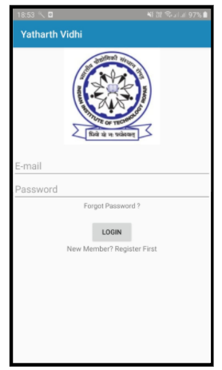
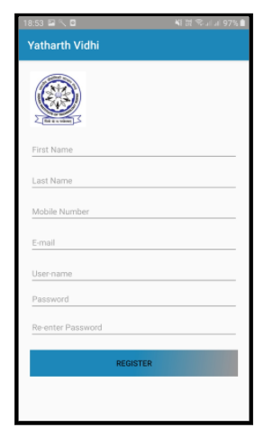
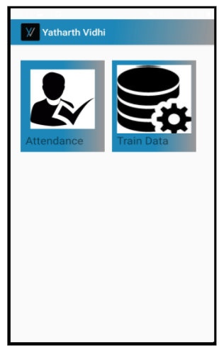
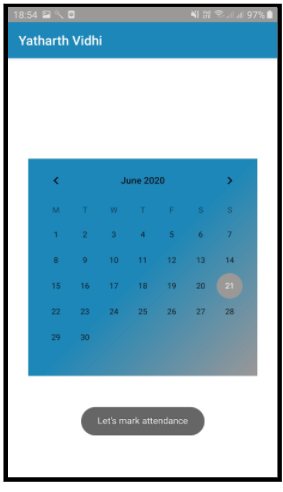
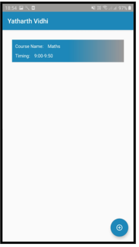
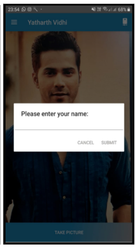
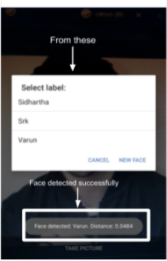

<h1>Motivation:</h1>

The main motive of the project is to develop an attendance application which will take
the attendance of the students by recognizing their face and fingerprint ( biometric). It
will save the time taken and efforts made by the professor in taking manual attendance.
With this attendance app, students will not be able to mark proxies for others.

<h1>Project Description:</h1>
<ol>
  <li><h3>Introduction:</h3>

Yatharth Vidhi is an attendance application. It will be installed in the professor's
mobile who is taking the attendance. Students’ data will be already trained in the
application and the mobile will be passed among the students for scanning their
faces in the camera. If it matches with the trained data,
then attendance will be marked present.
</li>

<li><h3> Design:</h3>
  <ol>
    <li>When we open our app, we get the login page. After this:</li>
    <ol>
      <li>If you are a member, add your credentials.</li>
      <li>If you are not a member, click Register.</li>
    </ol>
    <li>After login, we get to our main page, which has two options:</li>
    <ol>
      <li>Attendance: After this, we get a calendar to choose the date for marking attendance.</li>
      <li>02.Train data: After this, we get a list of subjects that have been registered under the professor’s name. The add button (circle at the button right
        corner), is used to add subjects under the professor’s name.</li>
    </ol>

Fig: Login page 

Fig: Register Page

Fig: Main Page 

Fig: After attendance icon

<h6>>Fig: After Train data icon</h6>

<li>After clicking the train icon and being directed to the list of subjects page, we click on
a particular subject for saving the students credential. Then we are taken to the
camera and after that, we train the data for face recognition of the students that are
enrolled in that particular subject. After training, you can go to the main page and
start taking attendance!!</li>

<li> After clicking on the attendance icon, we first have a calendar page and then a page
with the date and list of subjects that are registered under the professor’s name. Then
after clicking on a particular subject, we are taken to the camera and further xafter
recognition of the face, a popup appears with attendance marked successfully.</li>

Fig: After calendar page

Fig:While training 

Fig: While face recognition(attendance)
( Varun face’s detected)

</ol>

<li><h3>Methodology:</h3>
The main part of the application was to develop the face recognition algorithm. For
the face recognition under variation in lighting and facial expression, we have 4
different types of algorithms available given as:
  <ul>
    <li>Correlation</li>
    <li>A variant of the linear subspace method</li>
    <li>Eigenface method</li>
    <li>Fisherface method</li>
Among these we have used the Eigenface method in our application( we
implemented fisherface and eigenface methods but went forward with the eigenface
method.)

As other methods are computationally expensive and require great amounts of
storage, it is natural to pursue dimensionality reduction schemes. A technique now
commonly used for dimensionality reduction in computer vision—particularly in face
recognition—is principal components analysis (PCA). The Eigenface method is based
on linearly projecting the image space to a low dimensional feature space. However,
the Eigenface method, which uses principal components analysis (PCA) for
dimensionality reduction, yields projection directions that maximize the total scatter
across all classes, i.e., across all images of all faces. In choosing the projection which
maximizes total scatter, PCA retains unwanted variations due to lighting and facial
expression.
</li>
